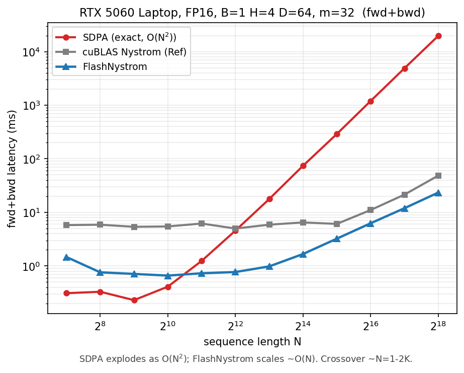
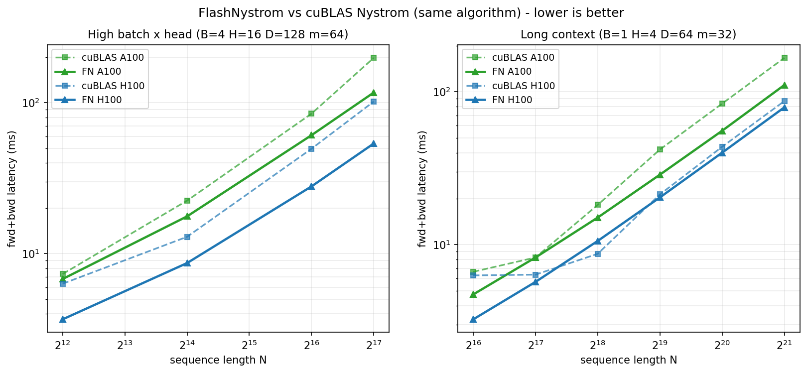
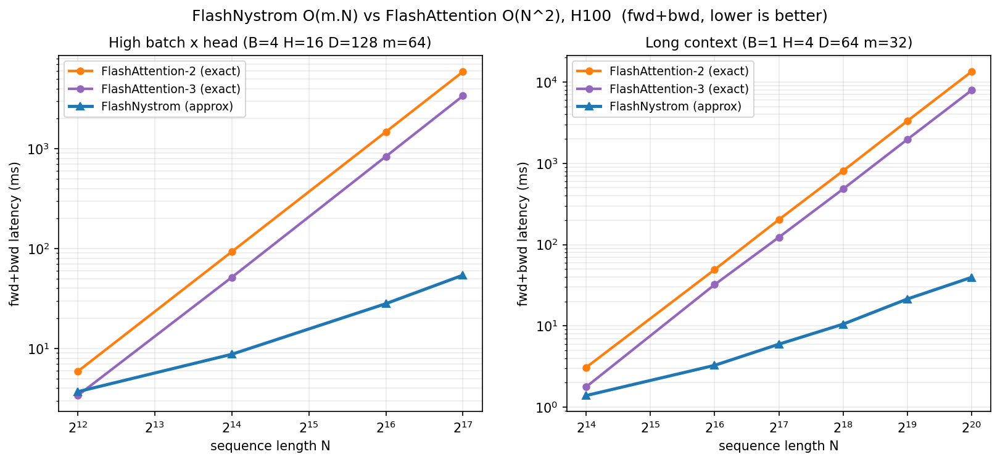
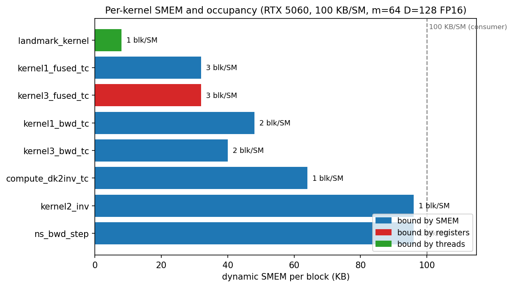

# FlashNystrom

[](https://colab.research.google.com/github/athrva98/FlashNystrom/blob/master/notebooks/quickstart.ipynb)

CUDA kernels for Nystromformer approximate attention. Forward and backward run in linear time and memory with respect to sequence length. The matmul-heavy stages use tensor cores. Backward gradients are exact against PyTorch autograd at FP32 numerical noise.

Open the Colab notebook above for a one-click install + smoke test + short latency demo. Switch the Colab runtime to L4 or A100 first; free-tier T4 (sm_75) is not supported.

The Nystromformer factorization is

```
attention(Q, K, V) = softmax(Q @ Kt^T) @ softmax(Qt @ Kt^T)^+ @ softmax(Qt @ K^T) @ V
```

where Qt and Kt are landmarks formed by segmented mean pooling of Q and K. The pseudoinverse is computed by unrolled Newton-Schulz iteration in FP32. The backward pass differentiates through every NS iterate via the chain rule. There is no Implicit Function Theorem dependence and no requirement that NS has converged.

## Scope

FlashNystrom is not a FlashAttention competitor. FlashAttention (v1/v2/v3/v4) implements *exact* O(N²) attention with IO-aware tiling. Its version bumps are hardware-targeted rewrites of the same algorithm: FA2 for Ampere and Ada, FA3 for Hopper WGMMA and TMA, FA4 for Blackwell TMEM. FlashNystrom implements a *different* attention math: the Nyström low-rank factorization, which is O(m·N·D + m³) with m landmarks. The relevant comparison is FlashNystrom against SDPA (using any FA generation under the hood) at long sequence length, where O(N²) starts to dominate and the approximation becomes worthwhile. At short N (under ~1–2K), exact attention is faster and you should use it.

The kernels borrow the FA2-era CUTLASS SM80 mma atom and the tiled-softmax with running-LSE pattern, but apply them to the three Nyström softmaxes rather than to one big QK^T. They are written in pre-Hopper idioms: no WGMMA, no TMA, no warp specialization, no TMEM. They run on Hopper and Blackwell (the build covers `sm_80;86;89;90`) and benefit from the higher SMEM and register counts on those parts via occupancy, but a Hopper-native rewrite would extract more peak throughput. See [the SMEM sizing discussion](#smem-sizing-and-occupancy) below.

## Status

20-epoch CIFAR-10 ViT (default settings, FP16 autocast, num_landmarks=32, newton_iter=6) reaches the same test accuracy as the SDPA and pure-PyTorch Nystromformer baselines:

| Config                          | test acc |
|---------------------------------|---------:|
| `F.scaled_dot_product_attention`|    66.7% |
| Pure-PyTorch Nystromformer      |    66.3% |
| FlashNystrom (this repo)        |    66.7% |

84 tests cover forward, backward, kernel-level isolation, the production cuBLAS + CUDA-graph NS backward path, and per-kernel regression against autograd-derived references.

## Install

```
git clone --recursive https://github.com/athrva98/FlashNystrom.git
cd FlashNystrom
pip install -e . --no-build-isolation
```

If you cloned without `--recursive`, pull the CUTLASS submodule first:

```
git submodule update --init
```

Requirements:

* PyTorch 2.0+ with CUDA support
* CUDA toolkit 12.2+
* Compute capability 8.0+ (Ampere, Ada, Hopper, Blackwell). The kernels use the SM80 16x8x16 mma atom and opt into up to ~96 KB of dynamic shared memory per CTA. They run on Hopper and Blackwell but are not Hopper-native (no WGMMA/TMA). SM75 and earlier are not supported.

## Quickstart

Module form:

```python
import torch
from flash_nystrom import FlashNystromAttention, NystromConfig

cfg = NystromConfig(num_landmarks=64, newton_iter=6, conv_kernel_size=3)
attn = FlashNystromAttention(dim=512, heads=8, config=cfg).cuda()

x = torch.randn(4, 4096, 512, device="cuda", dtype=torch.float16)
y = attn(x)
y.sum().backward()
```

Functional form (raw Q, K, V):

```python
from flash_nystrom import flash_nystrom_attention

q = torch.randn(B, H, N, D, device="cuda", dtype=torch.float16)
k = torch.randn(B, H, N, D, device="cuda", dtype=torch.float16)
v = torch.randn(B, H, N, D, device="cuda", dtype=torch.float16)

out = flash_nystrom_attention(q, k, v, num_landmarks=64, newton_iter=6)
```

## Latency

Forward and backward latency in milliseconds on an RTX 5060 Laptop (Blackwell consumer, 8 GB VRAM, sm_120), FP16, B=1, H=4, head_dim=64, num_landmarks=32, newton_iter=6. CUDA-event timed, median of 30 fwd+bwd runs after 5 warmups; reduced rep counts at N ≥ 16384 to keep wall-clock manageable. Three implementations:

- **FN**: this repo (custom CUDA forward + cuBLAS-graphs backward).
- **Ref**: the same Nyström algorithm written in plain PyTorch. Each matmul dispatches to cuBLAS via the `@` operator, each softmax to `torch.softmax`, each elementwise op to a torch CUDA kernel. No fusion across stages: every op is a separate launch with HBM round-trips between them, and the three softmaxes are not folded into a single pass. See `flash_nystrom/reference.py`.
- **SDPA**: `F.scaled_dot_product_attention`, which on PyTorch 2.x dispatches to the memory-efficient attention backend (a FlashAttention-class kernel). Exact O(N²) attention.

| N      | FN fwd | FN bwd | FN tot | Ref tot | SDPA fwd | SDPA bwd | SDPA tot | FN/Ref | FN/SDPA | SDPA − FN (ms) |
|-------:|-------:|-------:|-------:|--------:|---------:|---------:|---------:|-------:|--------:|---------------:|
|    128 |   0.19 |   1.28 |   1.47 |    5.79 |     0.05 |     0.26 |     0.31 |  3.9x  |   0.21x |          −1.16 |
|    256 |   0.16 |   0.60 |   0.76 |    5.88 |     0.06 |     0.27 |     0.33 |  7.7x  |   0.43x |          −0.43 |
|    512 |   0.16 |   0.54 |   0.71 |    5.38 |     0.04 |     0.19 |     0.23 |  7.6x  |   0.32x |          −0.48 |
|   1024 |   0.17 |   0.49 |   0.66 |    5.46 |     0.10 |     0.31 |     0.41 |  8.3x  |   0.62x |          −0.25 |
|   2048 |   0.18 |   0.55 |   0.73 |    6.19 |     0.29 |     0.95 |     1.24 |  8.5x  |   1.7x  |          +0.51 |
|   4096 |   0.20 |   0.57 |   0.77 |    4.99 |     1.06 |     3.51 |     4.56 |  6.5x  |   5.9x  |          +3.79 |
|   8192 |   0.23 |   0.75 |   0.98 |    5.89 |     4.14 |    13.59 |    17.73 |  6.0x  |  18.1x  |         +16.75 |
|  16384 |   0.38 |   1.29 |   1.67 |    6.49 |    17.07 |    57.01 |    74.08 |  3.9x  |  44.4x  |         +72.41 |
|  32768 |   0.69 |   2.54 |   3.23 |    6.09 |    69.28 |   221.28 |   290.56 |  1.9x  |  90.0x  |           +287 |
|  65536 |   1.47 |   4.79 |   6.26 |   11.06 |   276.98 |   921.72 |  1198.71 |  1.8x  |   191x  |         +1,192 |
| 131072 |   2.77 |   9.19 |  11.96 |   21.45 |  1122.66 |  3770.79 |  4893.45 |  1.8x  |   409x  |         +4,881 |
| 262144 |   5.35 |  18.05 |  23.40 |   48.59 |  4613.17 | 15081.63 | 19694.80 |  2.1x  |   842x  |        +19,671 |



The speedup columns are *base time / FN time*. Values > 1 mean FN is faster; values < 1 mean FN is slower than the base. The last column is the absolute time difference per fwd+bwd call (positive means FN is faster).

Reading the table:

- **The ratio compresses both ends. The absolute difference does not.** At N ≤ 1024 where SDPA wins, the loss is between 0.25 ms and 1.2 ms per call. That is below the noise floor of a typical training loop and well below any optimizer step. At N = 262144 where FN wins, the save is 19.7 seconds per fwd+bwd call. The ratio and the absolute column tell the same story but the absolute column is the one that matters for "does this make my training run actually finish."
- **At short N (≤ 1024), SDPA is faster than FN.** FN carries fixed overhead from its three softmaxes and the Newton-Schulz pseudoinverse. That overhead dominates while N² is still cheap. If your N stays under ~1 K, use SDPA.
- **The fwd+bwd crossover is between N = 1024 and N = 2048.** At N = 2048 FN is 1.7x faster than SDPA total. Above that point the gap widens monotonically.
- **Above N ≈ 8 K the speedup over SDPA grows roughly linearly with N**, as expected from FN's O(N) compute versus SDPA's O(N²). Doubling N from 16 K to 32 K roughly doubles the speedup (44x to 90x). Same at 32 K to 64 K (90x to 191x), 64 K to 128 K (191x to 409x), and 128 K to 256 K (409x to 842x).
- **FN beats Ref at every N tested.** Same algorithm; the gap is kernel fusion and GPU utilization. The FN/Ref ratio is largest at short N, where the reference pays fixed per-op launch overhead that FN folds into single kernels. It narrows to about 1.8x in the mid-range (32 K–64 K) and holds at 1.8x to 2.1x out to N = 256 K, where the saving is HBM traffic and the multi-CTA split that keeps the GPU busy at this batch×head.
- **Neither method OOMs at N = 262144 on 8 GB.** SDPA's wall is wall-clock (~20 s per fwd+bwd at N = 256 K), not memory. PyTorch's SDPA uses memory-efficient attention internally, so it scales linearly in memory; the O(N²) compute is what makes it unusable past 32 K or so in practice.

Reproduce with `python benchmarks/bench_fwd_bwd.py`.

## Datacenter GPUs: same algorithm, FlashNystrom vs cuBLAS

The 5060 table is FlashNystrom against *exact* attention. This one isolates kernel quality: FlashNystrom against the **same Nyström algorithm** in plain PyTorch (the `Ref` above, where every matmul is a cuBLAS call and every softmax a torch kernel, with no fusion across stages). Same math, same FLOPs; the only difference is the kernels. FP16, newton_iter=6. `f x` and `tot x` are cuBLAS_time / FN_time; values > 1 mean FN is faster.

**A100-80GB.** High batch×head (B=4, H=16, head_dim=128, m=64):

| N      | FN fwd | cuBLAS fwd | f x   | FN tot | cuBLAS tot | tot x |
|-------:|-------:|-----------:|------:|-------:|-----------:|------:|
|   4096 |   1.92 |       1.53 | 0.80x |   6.79 |       7.33 | 1.08x |
|  16384 |   3.40 |       3.14 | 0.93x |  17.66 |      22.45 | 1.27x |
|  65536 |   9.43 |      11.01 | 1.17x |  60.94 |      84.66 | 1.39x |
| 131072 |  17.62 |      21.45 | 1.22x | 116.78 |     198.26 | 1.70x |

A100, long context, few heads (B=1, H=4, head_dim=64, m=32):

| N       | FN fwd | cuBLAS fwd | f x   | FN tot | cuBLAS tot | tot x |
|--------:|-------:|-----------:|------:|-------:|-----------:|------:|
|   65536 |   0.81 |       1.59 | 1.97x |   4.73 |       6.65 | 1.41x |
|  131072 |   1.14 |       1.63 | 1.43x |   8.25 |       8.25 | 1.00x |
|  262144 |   1.83 |       2.77 | 1.52x |  15.05 |      18.21 | 1.21x |
|  524288 |   3.18 |       4.84 | 1.52x |  28.72 |      41.93 | 1.46x |
| 1048576 |   5.92 |       9.47 | 1.60x |  55.62 |      83.71 | 1.50x |
| 2097152 |  11.45 |      18.53 | 1.62x | 110.75 |     166.69 | 1.51x |

**H100-80GB.** High batch×head (B=4, H=16, head_dim=128, m=64):

| N      | FN fwd | cuBLAS fwd | f x   | FN tot | cuBLAS tot | tot x |
|-------:|-------:|-----------:|------:|-------:|-----------:|------:|
|   4096 |   1.22 |       1.77 | 1.45x |   3.67 |       6.32 | 1.72x |
|  16384 |   2.05 |       1.87 | 0.91x |   8.66 |      12.93 | 1.49x |
|  65536 |   5.26 |       5.94 | 1.13x |  27.90 |      49.56 | 1.78x |
| 131072 |   9.58 |      11.59 | 1.21x |  53.67 |     101.81 | 1.90x |

H100, long context, few heads (B=1, H=4, head_dim=64, m=32):

| N       | FN fwd | cuBLAS fwd | f x   | FN tot | cuBLAS tot | tot x |
|--------:|-------:|-----------:|------:|-------:|-----------:|------:|
|   65536 |   0.57 |       1.86 | 3.28x |   3.25 |       6.30 | 1.94x |
|  131072 |   0.75 |       1.83 | 2.44x |   5.71 |       6.37 | 1.12x |
|  262144 |   1.14 |       1.83 | 1.60x |  10.58 |       8.72 | 0.82x |
|  524288 |   1.97 |       2.37 | 1.20x |  20.39 |      21.33 | 1.05x |
| 1048576 |   3.58 |       4.42 | 1.23x |  40.00 |      43.70 | 1.09x |
| 2097152 |   6.84 |       8.55 | 1.25x |  79.15 |      86.95 | 1.10x |



Reading the tables:

- **The forward wins across N at low batch×head.** It is 1.4x to 2.0x on the A100 and 1.2x to 3.3x on the H100. This is the regime the parallelized landmark kernel fixed: a single landmark's segment of N/m rows used to be summed by one thread serially, which was latency-bound at large N; splitting that reduction across threads made it bandwidth-bound. The forward GEMMs (kernel1, kernel3) were already faster than cuBLAS here because fusion saves HBM traffic.
- **At high batch×head the forward crosses over to a win by mid N.** At small N it can lose, because fixed per-call costs (the three softmaxes and the Newton-Schulz pseudoinverse) dominate before there is enough N to amortize them.
- **End-to-end, FlashNystrom wins across the whole tested range:** A100 total 1.00x to 1.70x, H100 total 1.05x to 1.94x. The single exception is the H100 long-context point at N=262144 (0.82x), where the cuBLAS reference backward measured anomalously fast; the forward there is a 1.60x win.
- **The H100 widens the lead at high batch×head** (total up to 1.90x) and sharpens the low-batch forward win (the faster HBM3 and extra SMs feed the now bandwidth-bound landmark and GEMM kernels).

Reproduce with `modal run tools/modal_a100.py::bench_gaps` (A100) or `::bench_gaps_h100` (H100). Requires a Modal account and a one-time `modal setup`.

## FlashAttention-2 / FlashAttention-3 (exact attention), H100

The tables above compare FlashNystrom to the *same* Nyström algorithm in cuBLAS. This one compares it to the alternative people actually reach for: **exact** attention via FlashAttention. FA2 and FA3 compute exact O(N²) attention (FA3 is the Hopper-native current SOTA); FlashNystrom computes approximate O(m·N) Nyström. They are not the same computation, so this is a speed comparison that only matters where the Nyström approximation is acceptable (it is for the CIFAR-10 ViT, which matches the exact-attention baseline accuracy). H100-80GB, FP16, fwd+bwd, newton_iter=6. `FA2/FN` and `FA3/FN` are FA_total / FN_total; > 1 means FlashNystrom is faster. FA3 was built with its cluster and hdim-64/128 kernels intact (only genuinely unused variants trimmed), so these are its best kernels for these shapes.

High batch×head (B=4, H=16, head_dim=128, m=64):

| N      | FN tot | FA2 tot | FA3 tot | FA2/FN | FA3/FN |
|-------:|-------:|--------:|--------:|-------:|-------:|
|   4096 |   3.69 |    5.89 |    3.38 |  1.6x  |  0.9x  |
|  16384 |   8.75 |   93.1  |   51.6  | 10.6x  |  5.9x  |
|  65536 |  28.1  | 1477    |  837    | 52.5x  | 29.8x  |
| 131072 |  54.2  | 5901    | 3380    |  109x  | 62.4x  |

Long context, few heads (B=1, H=4, head_dim=64, m=32):

| N       | FN tot | FA2 tot | FA3 tot | FA2/FN | FA3/FN |
|--------:|-------:|--------:|--------:|-------:|-------:|
|   16384 |   1.39 |    3.09 |    1.78 |  2.2x  |  1.3x  |
|   65536 |   3.27 |   49.3  |   32.2  | 15.1x  |  9.9x  |
|  131072 |   5.95 |  203    |  123    | 34.1x  | 20.6x  |
|  262144 |  10.5  |  808    |  483    |   77x  |   46x  |
|  524288 |  21.4  | 3319    | 1966    |  155x  | 91.7x  |
| 1048576 |  39.5  | 13408   | 7904    |  340x  |  200x  |
| 2097152 |  76.8  | n/r     | n/r     |   -    |   -    |



Reading the tables:

- **At short N, use exact attention.** At N=4096 (high batch×head) FA3 is slightly faster than FN (0.9x), and the two are close in long context at N=16384 (1.3x). Exact attention is cheap when N² is small and carries no approximation error. The crossover is roughly N=4K to 16K.
- **Past the crossover the O(N²) wall takes over.** FlashNystrom's O(m·N) cost grows linearly while exact attention grows quadratically, so the gap widens fast: 5.9x at 16K, 30x at 65K, 62x at 131K (high batch×head); and in long context from 20x at 131K up to **200x at 1M tokens** versus FA3.
- **Exact attention eventually stops being practical.** At N=1M, FA2 is already 13 s per fwd+bwd call (FA3 ~8 s) and climbing quadratically; at 2M tokens (`n/r`) we no longer run it, while FlashNystrom finishes the full fwd+bwd in 77 ms.
- **FA3 is ~1.7x faster than FA2** here (Hopper-native kernels), so it is the right exact-attention baseline. FlashNystrom still pulls away from FA3 at long N.

Built and measured with `modal run tools/modal_a100.py::bench_fa_h100` (installs FA2 plus a trimmed FA3 Hopper build, then benchmarks).

## SMEM sizing and occupancy

The kernels are sized for the consumer SMEM envelope (~100 KB/SM on Ampere
consumer, Ada, and Blackwell consumer). The build does not auto-tune
tile sizes to the runtime device; the choice is fixed at compile time.

Per-kernel SMEM usage (probe output on an RTX 5060 Laptop, 100 KB/SM,
m=64, D=128, FP16, niter=6):

| Kernel                        | Dyn SMEM (KB) | Regs/thr | Blocks/SM (consumer) | Binding constraint |
|-------------------------------|--------------:|---------:|---------------------:|--------------------|
| `landmark_kernel` (fwd)       |           8   |      40  |                  1   | threads (1024/blk) |
| `kernel1_fused_tc` (fwd)      |          32   |      71  |                  3   | SMEM               |
| `kernel3_fused_tc` (fwd)      |          32   |     165  |                  3   | registers (= SMEM) |
| `kernel1_bwd_tc`              |          48   |     163  |                  2   | SMEM               |
| `kernel3_bwd_tc`              |          40   |     170  |                  2   | SMEM               |
| `compute_dk2inv_tc`           |          64   |     206  |                  1   | SMEM               |
| `kernel2_inv` (NS forward)    |          96   |      42  |                  1   | SMEM               |
| `ns_bwd_step`                 |          96   |      40  |                  1   | SMEM               |

Reproduce with `python tools/kernel_report.py`. (`landmark_kernel` is
threads-bound, not occupancy-starved: one 1024-thread block is 32 warps, and
it is bandwidth-bound after the segment-reduction parallelization.)



**Are we leaving performance on the table on bigger-SMEM GPUs?**

Yes and no, and not in the way most people assume.

What we get for free on bigger SMEM (H100 has 228 KB/SM, ~2.3× consumer):
- Occupancy scales automatically, because **most kernels are SMEM-bound**
  on the consumer card (see the Binding column). `kernel2_inv` and
  `ns_bwd_step` (96 KB, 1 block/SM at 100 KB) go to 2 blocks/SM. The 40 to
  64 KB kernels (`kernel3_bwd_tc`, `kernel1_bwd_tc`, `compute_dk2inv_tc`)
  each gain blocks/SM until their register count becomes the binder, e.g.
  `compute_dk2inv_tc` (64 KB) goes from 1 block/SM to its ~2-block register
  ceiling. So bigger SMEM does help these.
- The one kernel bigger SMEM does **not** help is the forward
  `kernel3_fused_tc`: registers and SMEM both allow only 3 blocks/SM at
  128 threads/block (165 regs/thr), so it is already at its register
  ceiling and extra SMEM changes nothing. A win there needs fewer
  registers (smaller accumulator fragments, recomputation), not more SMEM.

What we miss by not sizing for big SMEM:
- We do not multi-stage. Each kernel uses one SMEM buffer per role
  (sQ, sK, sV); the next tile cannot be prefetched while the current
  tile computes. FA2 uses a 2-stage `cp.async` pipeline on Ampere; FA3
  uses TMA-driven asynchronous loads with producer/consumer warp
  specialization on Hopper. Both trade SMEM for memory-latency hiding.
  Adding a second stage to our K/V buffer would roughly double its
  SMEM cost and is only a clear win where memory latency dominates
  compute, which is exactly the regime that benefits from bigger SMEM.
- We do not opt into the Hopper 228 KB envelope. The
  `cudaFuncSetAttribute(MaxDynamicSharedMemorySize, ...)` calls request
  the kernel's compile-time SMEM size, not the device max. On Hopper a
  multi-stage rewrite could push tiles to 128 KB+ and use TMA bulk
  copies. That is an FA3-class engineering effort.

The TL;DR: for the kernels that *are* SMEM-bound, bigger SMEM helps via
occupancy automatically. For the kernels that are register- or
compute-bound, more SMEM does nothing. The structural win we leave on
the table is async multi-stage pipelining, which is a non-trivial
rewrite and is also the rewrite that would unlock FA3/FA4-style
hardware-native idioms. They are the same project.

## PyTorch compatibility

`FlashNystromAttention` is a regular `nn.Module` and `flash_nystrom_attention` is a regular function. Standard PyTorch idioms work without changes.

| Workflow                                  | Status |
|-------------------------------------------|--------|
| Eager forward + backward                  | works |
| FP16 / BF16 / FP32 input dtypes           | works |
| `torch.amp.autocast("cuda", dtype=...)`   | works |
| `nn.Module` composition, `state_dict`     | works |
| DDP / FSDP gradient sync                  | works (gradients flow through standard autograd; no custom collective is needed) |
| `torch.compile`                           | runs, with a graph break at the FlashNystrom forward call. The kernel itself executes normally, but Dynamo cannot fuse across the boundary. A `torch.library.custom_op` registration would eliminate the graph break and is the natural follow-up if `torch.compile` integration matters to you. |
| `torch.jit.script`                        | not supported. Custom autograd Functions are not scriptable. |
| `torch.export`                            | not currently supported. Depends on the `custom_op` registration above. |

Typical training loop with autocast (matches the CIFAR-10 example):

```python
optimizer = torch.optim.AdamW(model.parameters(), lr=1e-3)
for x, y in loader:
    with torch.amp.autocast("cuda", dtype=torch.float16):
        logits = model(x.cuda())
        loss = F.cross_entropy(logits, y.cuda())
    optimizer.zero_grad(set_to_none=True)
    loss.backward()
    optimizer.step()
```

## Configuration

`NystromConfig` fields:

| Field              | Default | Notes |
|--------------------|--------:|-------|
| `num_landmarks`    |      64 | Capped at 64 by kernel tile size. |
| `newton_iter`      |       6 | NS iterations for the pseudoinverse. Backward correctness is independent of convergence. |
| `conv_kernel_size` |       3 | Depthwise conv1d residual on V. Set to 0 to disable. |
| `use_conv_residual`|    True | Master switch for the conv residual. |
| `fast_dk2inv`      |    True | Internal flag for a debug-only fallback path. Leave at the default. |

## Limitations

* `head_dim` is restricted to 64 or 128.
* `num_landmarks` is capped at 64.
* FP32 backward at `head_dim=128` is not supported (SMEM overflow). Use FP16 or BF16.
* Sequence length must be at least `num_landmarks`.
* Compute capability 8.0 or newer.

## Repository layout

```
csrc/                          CUDA source
  flash_nystrom.cu             pybind entry points
  flash_nystrom_kernels.cu     kernel orchestration
  kernels/                     forward kernels
  kernels/backward/            backward kernels and isolation hooks
flash_nystrom/                 Python package (autograd Function, config, reference)
tests/                         84 pytest tests
benchmarks/                    latency and CIFAR-10 training scripts
examples/                      end-to-end usage examples
notebooks/                     Colab quickstart
third_party/cutlass/           CUTLASS submodule
```

## Tests

```
pytest tests/
```

`tests/test_ns_bwd_kernel.py` contains element-wise isolation tests for every backward kernel, with the FP32 reference computed in PyTorch from the same algebra the CUDA kernel implements. The kernels are pinned to FP32 noise across `newton_iter` in {1, 2, 3, 6, 10, 15, 20} and across sequence lengths that exercise both tile-aligned and partial-tile code paths.

## References

* Xiong, Zeng, Chakraborty, Tan, Fung, Li, Singh. *Nystromformer: A Nystrom-based Algorithm for Approximating Self-Attention*. AAAI 2021.
* Dao, Fu, Ermon, Rudra, Re. *FlashAttention: Fast and Memory-Efficient Exact Attention with IO-Awareness*. NeurIPS 2022.
* Dao. *FlashAttention-2: Faster Attention with Better Parallelism and Work Partitioning*. ICLR 2024.
* Shah, Bikshandi, Zhang, Thakkar, Ramani, Dao. *FlashAttention-3: Fast and Accurate Attention with Asynchrony and Low-precision*. NeurIPS 2024.

The kernel layouts, the tiled-softmax running-LSE state machine, and the
CUTE SmemLayoutAtomQ/KV patterns are adapted from FlashAttention-2. We do
not implement FA3-style asynchrony (WGMMA + TMA + warp specialization);
those are Hopper-specific and would be a separate kernel family.
FlashAttention solves exact O(N²) attention; FlashNystrom uses these
techniques to implement the Nyström low-rank factorization instead.

## License

Apache License 2.0. See `LICENSE`.

## Author

Athrva Pandhare. athrva98@gmail.com.

Developed with Claude's help.
